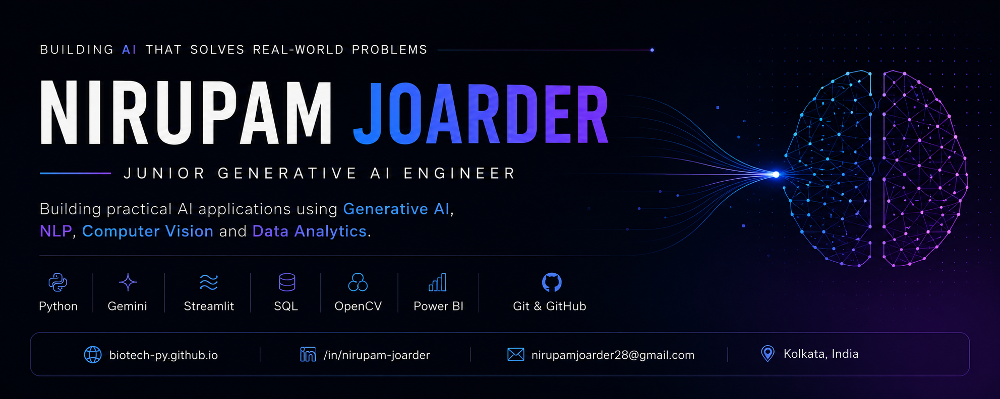

  
     

 
   
# Hi, I'm Nirupam Joarder 👋  
 
🤖 Junior Generative AI Engineer

🎓 B.Tech in Biotechnology | National Institute of Technology Rourkela

💻 Python • SQL • Data Analytics • NLP • Generative AI

🚀 Passionate about building AI-powered applications, intelligent data solutions, and real-world Generative AI systems.
 
---
## 🚀 About Me

- 🤖 Junior Generative AI Engineer passionate about building AI-powered applications using Python and Large Language Models.
- 💻 Experienced in Python, SQL, Data Analytics, NLP, and developing end-to-end AI applications.
- 📊 Interested in transforming raw data into intelligent, data-driven solutions through analytics and automation.
- 🧠 Built projects in Generative AI, Biomedical NLP, Computer Vision, Data Analytics, and Remote Sensing.
- 🌱 Currently exploring Retrieval-Augmented Generation (RAG), Prompt Engineering, and modern Generative AI workflows.
- 🚀 Always learning, building, and exploring new AI technologies.

--- 
 
## 🛠 Tech Stack

### 💻 Programming Languages

---

### 🤖 AI & Machine Learning

 
---

### 📊 Data Analytics

---

### 🖥️ Computer Vision

---
 
### 🌍 Geospatial Analytics
 

---

### 🚀 Deployment & Development

---

# 🚀 Featured Projects

A collection of AI, Machine Learning, Data Analytics, Computer Vision, and Intelligent Systems projects demonstrating practical applications across NLP, predictive analytics, geospatial analytics, and digital twin technologies.

---

## 🧠 Biomedical Research Paper Analyzer

**Tech Stack**

`Python` `Streamlit` `Google Gemini AI` `PyMuPDF` `ReportLab`

> AI-powered application for analyzing biomedical research papers. Upload a research paper PDF to automatically generate structured summaries, assess research quality, identify key findings, detect research gaps, suggest future research directions, answer questions about the paper, and generate a downloadable analysis report.

---

## 📊 Clinical Data Analytics Dashboard

**Tech Stack**

`Python` `Pandas` `NumPy` `Power BI`

> End-to-end data analytics application involving data preprocessing, exploratory data analysis, visualization, and interactive Power BI dashboards for data-driven decision-making.

---

## 🩸 Automated Blood Cell Detection & Classification

**Tech Stack**

`Python` `YOLOv8` `OpenCV` 

> Deep learning application for automated blood cell detection, classification, and counting using YOLOv8, OpenCV, and an interactive Gradio interface.

---

## 📈 Diabetes Risk Prediction

**Tech Stack**

`Python` `Pandas` `NumPy` `Logistic Regression` `Power BI`

> Machine learning application for diabetes risk prediction using data preprocessing, exploratory analysis, Logistic Regression, and Power BI visualization to identify key clinical risk factors.

---

## 🌿 Climate Stress Monitoring System

**Tech Stack**

`Python` `QGIS` `Remote Sensing` `Sentinel-2` `NDVI`

> Remote sensing application for climate stress assessment using Sentinel-2 satellite imagery, NDVI analysis, and QGIS to monitor vegetation health and environmental conditions.

---

## ⚙️ Magnesium Implant Digital Twin

**Tech Stack**

`Python` `Streamlit` `Corrosion Analysis` `FESEM` `FTIR` `XRD`

> AI-powered digital twin application for magnesium implant evaluation using corrosion, wettability, adhesion, FESEM, FTIR, and XRD characterization data to support biomaterials analysis.

---

# 💼 Technical Focus Areas

### 🤖 Generative AI & AI Applications

- LLM Applications
- Prompt Engineering
- AI-Powered Document Analysis
- Research Paper Analysis
- Google Gemini AI

---

### 📊 Data Analytics & Machine Learning

- Exploratory Data Analysis
- Predictive Analytics
- Machine Learning
- Data Visualization
- Power BI Dashboards

---

### 👁️ Computer Vision

- Object Detection
- Image Classification
- YOLOv8
- OpenCV
- Medical Image Analysis

---

### 🌍 Geospatial Analytics

- Remote Sensing
- Sentinel-2
- NDVI Analysis
- QGIS

---

### ⚙️ Scientific Computing & Digital Twins

- Streamlit Applications
- Scientific Data Visualization
- Biomaterials Analytics
- Digital Twin Applications

---

# 🎯 Current Interests

- Generative AI & Large Language Models (LLMs)
- Prompt Engineering & AI Workflows
- Intelligent Document Processing
- Retrieval-Augmented Generation (RAG)
- AI Agents & Agentic Systems
- Machine Learning & Data Analytics
- Computer Vision Applications

---

## 📊 GitHub Stats

  

  

---

## 🐍 Contribution Snake

  

---

# 📬 Let's Connect    

---

⭐ Passionate about building practical AI applications that solve real-world problems using Generative AI, Machine Learning, and Data Analytics.
