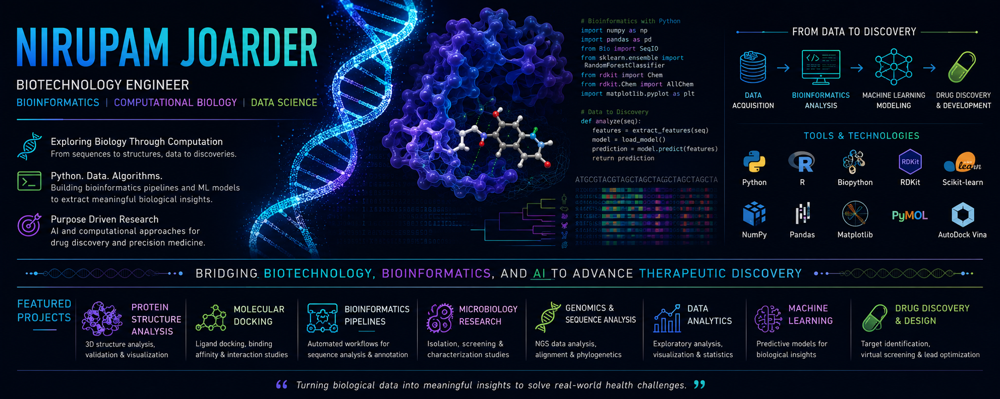

<p align="center">
    
</p> 

# Hi, I'm Nirupam Joarder 👋

🤖 Junior Generative AI Engineer

🎓 B.Tech in Biotechnology | National Institute of Technology Rourkela

💻 Python • SQL • Data Analytics • NLP • Generative AI

🚀 Passionate about building AI-powered applications, intelligent data solutions, and real-world Generative AI systems.

---
## 🚀 About Me

- 🤖 Junior Generative AI Engineer passionate about building AI-powered applications using Python and Large Language Models.
- 💻 Experienced in Python, SQL, Data Analytics, NLP, and developing end-to-end AI applications.
- 📊 Interested in transforming raw data into intelligent, data-driven solutions through analytics and automation.
- 🧠 Built projects in Generative AI, Biomedical NLP, Computer Vision, Data Analytics, and Remote Sensing.
- 🌱 Currently exploring Retrieval-Augmented Generation (RAG), Prompt Engineering, and modern Generative AI workflows.
- 🚀 Always learning, building, and exploring new AI technologies.

--- 

## 🛠 Tech Stack

### 💻 Programming Languages


---

### 🤖 AI & Machine Learning


---

### 📊 Data Analytics


---

### 🖥️ Computer Vision


---

### 🌍 Geospatial Analytics


---

### 🚀 Deployment & Development


---

# 🚀 Featured Projects

# 🧠 LLM-Powered Research Intelligence Platform

<p align="left">

<a href="https://github.com/biotech-py/Biomedical_Research_Intelligence_Platform">

</a>

<a href="https://biomedicalresearchintelligenceplatform.streamlit.app/">

</a>

</p>

**Tech Stack**

`Python` `Transformers` `NLP` `Streamlit`

> AI-powered platform for biomedical literature summarization, biomedical entity extraction, and interactive research analytics using Transformer-based NLP models.

---

# 📊 Clinical Data Analytics Dashboard

<p align="left">

<a href="https://github.com/biotech-py/Clinical_Data_Analytics_Project">

</a>

</p>

**Tech Stack**

`Python` `Pandas` `NumPy` `Power BI`

> End-to-end data analytics workflow involving data preprocessing, exploratory data analysis, visualization, and interactive dashboards for data-driven decision making.

---

# 🩸 Automated Blood Cell Detection & Classification

<p align="left">

<a href="https://github.com/biotech-py/automated-blood-cell-detection-deep-learning">

</a>

<a href="https://huggingface.co/spaces/nirupam-joarder/blood-cell-detector">

</a>

</p>

**Tech Stack**

`Python` `YOLOv8` `OpenCV` `Gradio`

> Deep learning application for automated blood cell detection, classification, and counting using YOLOv8 with an interactive Gradio interface.

---

## 📈 Data Science & Machine Learning

<p align="left">

<a href="https://github.com/biotech-py/Diabetes-Risk-Prediction-Clinical-Analytics">

</a>

</p>

**Tech Stack**

`Python` `Pandas` `NumPy` `Logistic Regression` `Power BI`

> Healthcare analytics and machine learning project used to predict diabetes risk and identify key clinical risk factors through data preprocessing, exploratory analysis, and model-based prediction.


---


## 🌿 Climate & Environmental Analytics

<p align="left">

<a href="https://github.com/biotech-py/Climate-Stress-Monitoring-System">

</a>

</p>

**Tech Stack**

`Python` `QGIS` `Remote Sensing` `Sentinel-2` `NDVI`

> Climate stress assessment using Sentinel-2 satellite imagery and NDVI analysis to monitor vegetation health. The project processes geospatial data, computes vegetation indices, and visualizes environmental stress using QGIS and Python.

---

## 🧬 Computational Drug Discovery

<p align="left">

<a href="https://github.com/biotech-py/EGFR-T790M-Computational-Drug-Discovery">

</a>

</p>

**Tech Stack**

`Python` `BioPython` `RDKit` `PyMOL`

> Computational drug discovery workflow focused on the EGFR T790M mutation. The project analyzes protein–ligand interactions, molecular properties, and structural features to support lead prioritization using computational biology tools.

---

# 🚀 Featured Projects

## 🧬 Bioinformatics & Computational Biology

| Project | Description |
|----------|-------------|
| 🏆 **EGFR T790M Computational Drug Discovery** | Molecular docking and inhibitor screening against the EGFR T790M drug-resistance mutation using AutoDock Vina and PyMOL. |
| ⚠️ **EGFR T790M Drug Resistance Analysis** | Structural investigation of the clinically important EGFR T790M mutation and its role in resistance to first-generation EGFR inhibitors. |
| 💊 **EGFR Gefitinib Interaction Analysis** | Protein–ligand interaction analysis of the EGFR–Gefitinib complex with binding pocket characterization and structural visualization. |
| 🧬 **p53 AlphaFold Structure Analysis** | Structural analysis of the tumor suppressor protein p53 using AlphaFold predictions and bioinformatics tools. |
| 🧪 **Insulin Mutation Impact Analysis** | Computational investigation of disease-associated insulin mutations and their structural consequences. |
| 🌍 **Primate Insulin Comparative Analysis** | Comparative sequence and evolutionary analysis of insulin across different primate species. |

---

# 📚 Bioinformatics Learning Journey

```text
Primate Insulin Comparative Analysis
                ↓
Insulin Mutation Impact Analysis
                ↓
p53 AlphaFold Structure Analysis
                ↓
EGFR Gefitinib Interaction Analysis
                ↓
EGFR T790M Drug Resistance Analysis
                ↓
EGFR T790M Computational Drug Discovery
```

### 🌱 Phase 1 — Foundations of Bioinformatics
• Primate Insulin Comparative Analysis  
• Insulin Mutation Impact Analysis  

### 🧬 Phase 2 — Structural Biology
• p53 AlphaFold Structure Analysis  

### 💊 Phase 3 — Protein–Ligand Interactions
• EGFR Gefitinib Interaction Analysis  

### ⚠️ Phase 4 — Drug Resistance Mechanisms
• EGFR T790M Drug Resistance Analysis  

### 🚀 Phase 5 — Computational Drug Discovery
• EGFR T790M Computational Drug Discovery  

---

### 🤖 AI & Biomedical Research

[](https://github.com/biotech-py/Biomedical-Research-Paper-Analyzer)
[](https://biomedical-research-paper-analyzer.streamlit.app/)

[](https://github.com/biotech-py/Biomedical_Research_Intelligence_Platform)
[](https://github.com/biotech-py/Biomedical_Research_Intelligence_Platform)

---

### 🩸 Deep Learning & Medical Imaging

[](https://github.com/biotech-py/automated-blood-cell-detection-deep-learning)
[](https://huggingface.co/spaces/nirupam-joarder/blood-cell-detector)

> Deep learning-based blood cell detection, classification, and counting using YOLOv8, OpenCV, Gradio, and Hugging Face Spaces.

---

### 🌿 Climate & Environmental Bioinformatics

[](https://github.com/biotech-py/Climate-Stress-Monitoring-System)
[](https://github.com/biotech-py/Climate-Stress-Monitoring-System)

> Climate Stress Assessment using Sentinel-2 Satellite Imagery and NDVI-Based Vegetation Health Analysis with QGIS and Remote Sensing.

---

### 🦴 Biomaterials & Biomedical Engineering

[](https://github.com/biotech-py/Magnesium_Implant_Digital_Twin)
[](https://magnesiumimplantdigitaltwin-96wkxuah2fmz2pbkhphhux.streamlit.app/)

---

### 📊 Healthcare Analytics & Machine Learning

[](https://github.com/biotech-py/Diabetes-Risk-Prediction-Clinical-Analytics)

[](https://github.com/biotech-py/Clinical_Data_Analytics_Project)

[](https://github.com/biotech-py/Biomedical_EDA_Project)

---

## 🎯 Current Interests

* Computational Drug Discovery
* Structural Bioinformatics
* Molecular Docking & Virtual Screening
* Cancer Biology
* AI for Drug Discovery
* Biomedical Data Science
* Deep Learning for Medical Imaging
* Remote Sensing & Earth Observation

---

## 🛠 Core Skills

**Bioinformatics**
* BioPython
* Structural Bioinformatics
* Protein Structure Analysis
* Protein–Ligand Interaction Analysis
* Molecular Docking (AutoDock Vina)
* Binding Pocket Analysis
* Comparative Sequence Analysis
* AlphaFold Structure Analysis

**Deep Learning & Computer Vision**
* YOLOv8
* OpenCV
* Medical Image Analysis
* Object Detection & Classification

**GIS & Remote Sensing**
* QGIS
* Sentinel-2 Satellite Imagery
* NDVI Analysis
* Earth Observation

**Programming & Analytics**
* Python
* SQL
* Pandas
* NumPy
* Matplotlib
* Streamlit

**AI & Research**
* Biomedical Research Analytics
* Clinical Data Analytics
* AI Applications in Drug Discovery
* Generative AI Applications
* Scientific Computing
* Hugging Face Spaces

---

## 🚀 Currently Building

🤖 AI Drug Discovery Scientist Roadmap

⚗️ Advanced Molecular Docking & Virtual Screening

🧬 Molecular Dynamics Simulations (GROMACS)

📊 Transcriptomics & RNA-seq Analysis

🧠 AI Applications in Drug Discovery

🛰️ Advanced Remote Sensing & Climate Bioinformatics

---

## 📊 GitHub Stats

<p align="center">
  
</p>

<p align="center">
  
</p>

---

## 📈 Contribution Graph

[](https://github.com/biotech-py)

---

## 📫 Connect With Me

📧 Email: [joardernirupam@gmail.com](mailto:joardernirupam@gmail.com)

💼 LinkedIn: https://www.linkedin.com/in/nirupam-joarder

🐙 GitHub: https://github.com/biotech-py

---

⭐ Exploring the intersection of Bioinformatics, Computational Biology, AI, and Drug Discovery.
